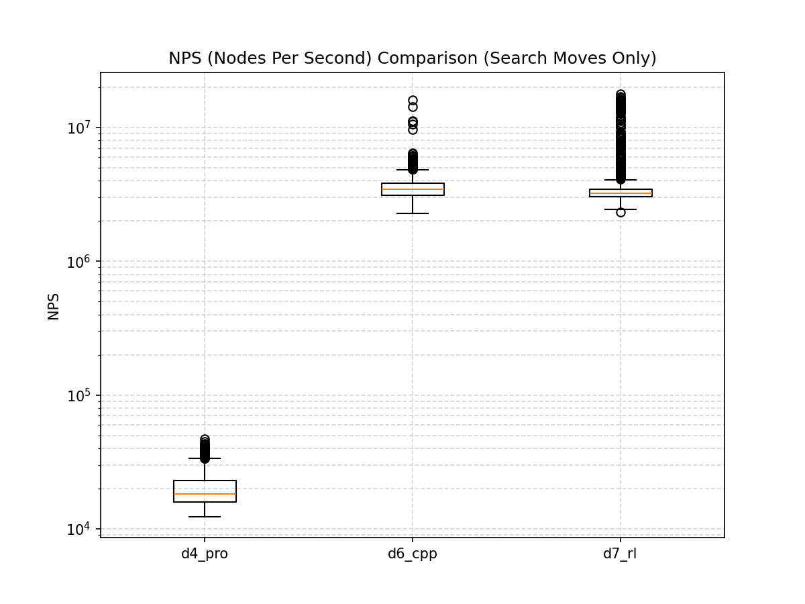
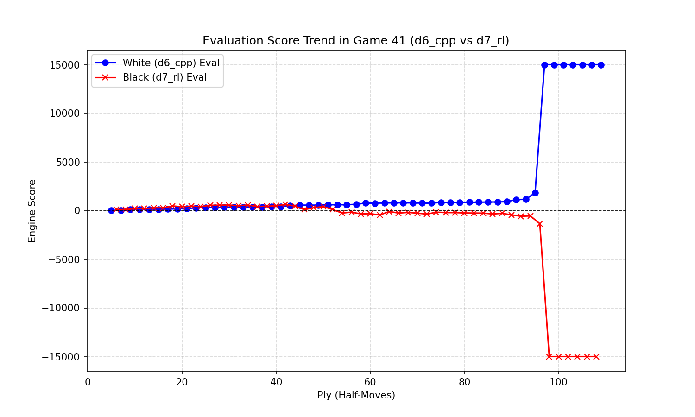

# 西洋棋 Agent 對戰大賽統計報告

本對戰使用 10 核心平行運算，對戰雙方各擔任 10 場白棋與 10 場黑棋，共 20 場對局。

## 對戰勝率統計

| 對戰組合 (Agent A vs Agent B) | Agent A 做白勝率 | Agent A 做黑勝率 | 總勝率 (A / B / 和) | Agent A 勝分率 |
| :--- | :---: | :---: | :---: | :---: |
| **d4_pro** vs **d6_cpp** | 0.0% | 0.0% | 0勝 / 20敗 / 0和 | 0.0% |
| **d4_pro** vs **d7_rl** | 35.0% | 30.0% | 6勝 / 12敗 / 1和 | 32.5% |
| **d6_cpp** vs **d7_rl** | 100.0% | 100.0% | 20勝 / 0敗 / 0和 | 100.0% |

## 搜尋效能對比 (NPS)

下圖展示了三種 Agent 搜尋節點速度的對比（對數座標軸，已排除開局庫與殘局庫直接回傳 0 NPS 的著手）：

| Agent | 平均 NPS | 最大 NPS | 走子數 |
| :--- | :---: | :---: | :---: |
| d4_pro | 20190.3 | 47221.7 | 1561 |
| d6_cpp | 3551025.7 | 16087093.3 | 1372 |
| d7_rl | 3666374.3 | 17916052.4 | 1618 |

## 評估函數分數變化趨勢

我們選擇了第 41 局 (d6_cpp vs d7_rl，共 105 步) 來觀察對局中各自評估分數的變化：

> **註**：C++ 引擎與 Python Alpha-Beta 引擎的分數大多為輪到該方時的相對估值。30000 代表 Tablebase 殘局庫宣告的勝利。
