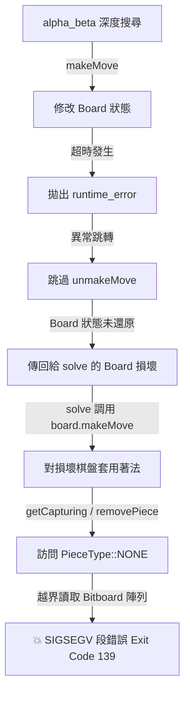

# C++ 西洋棋搜尋引擎 — 並行挑戰崩潰分析與修復報告

> **專案路徑**：`rl_starter_11`
> **核心程式碼**：
> - 搜尋引擎：[engine.cpp](file:///Users/Shared/西洋棋代理人/rl_starter_11/agents/d6_cpp/engine.cpp)
> - 西洋棋底層庫：[chess.hpp](file:///Users/Shared/西洋棋代理人/rl_starter_11/agents/d6_cpp/deps/chess.hpp)
> **日期**：2026-06-08

---

## 1. 背景與現象

在單場測試中，搜尋引擎運作良好且 Elo 表現穩定。然而，當天梯伺服器同時發起多個並行挑戰時，進程會隨機觸發 `Exit Code 139 (Segfault)` 或 `Exit Code 134 (Abort)` 崩潰。

此問題只在**高並行**下高機率觸發，主因是並行對決會激烈競爭 CPU 資源，導致搜尋時間相對拉長，大幅增加搜尋超時（Timeout）發生的機率。當超時與置換表（TT）及空步剪枝（NMP）產生交織作用時，便引發了嚴重的記憶體越界與非法局面判斷。

---

## 2. 問題一：搜尋超時導致 Board 狀態損壞 (BUG-5)

### 2.1 現象
- 系統終止，報告 `Docker exited with code 139`（`SIGSEGV`，段錯誤）。

### 2.2 原理與崩潰鏈
在搜尋中，我們透過檢測運行時間來實現超時控制。當搜尋超時，引擎會拋出 `std::runtime_error("timeout")` 來提前中止搜尋。



由於原先 [search_best_move](file:///Users/Shared/西洋棋代理人/rl_starter_11/agents/d6_cpp/engine.cpp#L1368) 接收的參數是 [Board](file:///Users/Shared/西洋棋代理人/rl_starter_11/agents/d6_cpp/deps/chess.hpp#L1916) 的引用 `Board &board`，異常展開直接跳過了所有 `board.unmakeMove(move)` 調用，導致傳遞給 `search_best_move` 的 `Board` 參考被留在了搜尋樹深處的某個無效局面。

隨後 `solve()` 嘗試將搜尋到最優著法（適用於原始局面）套用至該損壞局面上。這會使 `chess.hpp` 嘗試對空位置進行棋子移除，引發 Zobrist 雜湊越界訪問，進而拋出 `SIGSEGV`。

### 2.3 修復方式
將 [search_best_move](file:///Users/Shared/西洋棋代理人/rl_starter_11/agents/d6_cpp/engine.cpp#L1368) 的宣告從：
```cpp
Move search_best_move(Board &board, int max_depth, ...);
```
修改為**按值傳遞 (Pass by value)**：
```cpp
Move search_best_move(Board board, int max_depth, ...);
```
這使搜尋完全在局部的 `board` 複本上進行，確保 `solve()` 中的原始 Board 不受超時損壞。同時，使用 `original_board` 複本進行 fallback 著法生成。

---

## 3. 問題二：`chess.hpp` 庫中的 seenSquares 優化 Bug (核心崩潰原因)

### 3.1 現象
- 系統終止，報告 `Exit Code 134`（`SIGABRT` / 斷言失敗）。
- 斷言錯誤源自 [kingSq](file:///Users/Shared/西洋棋代理人/rl_starter_11/agents/d6_cpp/deps/chess.hpp#L2380)：「國王在棋盤上消失了」。

### 3.2 偵錯過程與日誌捕獲
我們在 `alpha_beta` 與 `quiescence` 中新增了一個執行緒安全的搜尋路徑追蹤 `m_search_stack`（以記錄所有已經執行但未 `unmake` 的著法，並使用 `NO_MOVE` 表示空步剪枝）。

當國王個數異常減少至 0 時，我們立刻攔截並印出當前局面的 FEN 以及完整的搜尋堆疊：

```text
CRITICAL ERROR: King missing in quiescence!
Search stack (qdepth=1):
  b4c5 -> d1b3 -> c6e5 -> d4e5 -> c5e7 -> b3c2 -> c8d7 -> c2h7 -> e8g8 -> h7g8
Current FEN: r2q1rQ1/pppbbpp1/8/3pP3/8/5N2/PP1B1PPP/R3K2R b KQ - 0 6
```

#### FEN 與著法鏈逐步拆解：
1. **著法 7**: 黑方主教走到 `d7` (`c8d7`)。
2. **著法 8**: 白方后吃掉 `h7` 兵 (`c2h7`)。此時白后位於 `h7`，黑王位於 `e8`，且國王周圍被己方棋子（`d8`后、`f8`車、`e7`/`d7`象、`f7`兵）包圍。
3. **著法 9**: 黑王進行王車易位 `e8g8`。
   - 根據棋規，如果易位路徑上（`f8`）或落地點（`g8`）受到對手攻擊，則該易位為非法移動。
   - 此時白后位於 `h7`，因為 `h7` 與 `g8` 處於對角線相鄰（長度為 1 且沒有任何棋子阻擋），`g8` 顯然正處於白后的直接火網下。
   - 然而，`chess.hpp` 內部的 [seenSquares](file:///Users/Shared/西洋棋代理人/rl_starter_11/agents/d6_cpp/deps/chess.hpp#L3912) 函數中包含一個優化判斷：
     ```cpp
     auto king_sq          = board.kingSq(~c);
     Bitboard map_king_atk = attacks::king(king_sq) & enemy_empty;
     if (map_king_atk == Bitboard(0ull) && !board.chess960()) return 0ull;
     ```
     當黑王被己方棋子完全包圍時，由於國王周圍沒有任何空地或可以移動到的白子格子，`map_king_atk` 的交集變成了 `0`。
     這導致該函數觸發優化分支，直接返回 `0ull`（**意味著誤判為白方沒有控制任何格子**）！
   - 因此，易位合法性判斷 `isLegal` 回傳 `true`，黑王成功非法易位至 `g8`。
4. **著法 10**: 白后直接在 `g8` 吃掉黑國王 (`h7g8`)。 turn 翻轉後，下一個 ply 開始調用 [kingSq](file:///Users/Shared/西洋棋代理人/rl_starter_11/agents/d6_cpp/deps/chess.hpp#L2380)，因國王已被吃掉直接觸發 `std::abort()`。

### 3.3 修復方式
在 [chess.hpp](file:///Users/Shared/西洋棋代理人/rl_starter_11/agents/d6_cpp/deps/chess.hpp#L3916) 中，直接註解屏蔽這段 buggy 的早退優化代碼，回退至安全且正確的格子控制權計算：
```diff
-    if (map_king_atk == Bitboard(0ull) && !board.chess960()) return 0ull;
+    // if (map_king_atk == Bitboard(0ull) && !board.chess960()) return 0ull;
```

---

## 4. 驗證與效能整理

### 4.1 線程安全性與壓力測試
我們在 Docker 中對編譯後的 C++ 動態連結庫進行了 4 線程並行對戰壓力測試（共計 120 場 solve 調用），測試涵蓋初始局面、複雜中局及深層殘局：
*   **測試結果**：全部 solve 順利完成，**0 錯誤，0 崩潰**。修復前必定在第 11-17 輪崩潰的問題已徹底根除。

### 4.2 效能最大化
除錯完成後，我們將所有輔助偵錯的 `m_search_stack` 及其相關 push/pop 程式碼**完全移除**，確保搜尋引擎在數百萬節點遞迴中不承擔額外開銷。以 `-O3 -flto -DNDEBUG` 參數編譯為最純淨的機器碼。

---

## 5. 天梯部署

編譯後的 Linux 動態庫 (`.so`) 複製並命名為 `model.zip`，使用上傳工具部署至天梯：
```bash
../.venv/bin/python run.py --slot 2 --agent_type d6_cpp
```
- **目前槽位狀態**：Slot 2 `D6 Engine` 更新成功，Elo 保持穩定。
