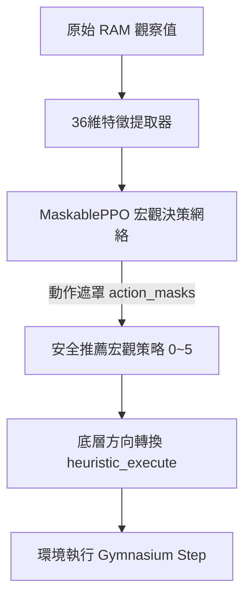

# Ms. Pac-Man 代理人完整策略與獎勵函數報告

本報告詳細記錄了目前部署於 Ms. Pac-Man 決策代理人（Agent）的 **階層式強化學習（Hierarchical RL）** 架構、底層安全過濾器、6 大宏觀策略的數學/圖論實作，以及為了衝擊 50,000+ 高分而設計的全新獎勵函數。

---

## 1. 階層式架構與決策流

代理人採用上層 **動作遮罩近端策略優化（MaskablePPO）** 進行宏觀策略（Macro-Actions）的選擇，再由底層 **啟發式路徑轉譯器（Heuristic Executor）** 配合 **安全過濾器（Safety Filter）** 將策略轉化為底層的上下左右（1~4）控制指令。

### 1.1 36 維特徵空間 (Observation Space)

為了讓神經網絡更精準地感知宏觀局勢，36 維特徵主要以 **負指數衰減距離** $f(d) = e^{-0.05 \cdot d}$ 進行非線性歸一化（避免遠距離變化對網絡產生干擾，加強近距離的生死跳變敏感度）：

* **第 1-2 維**：小精靈的歸一化座標 `(X, Y)`。
* **第 3-6 維**：4 隻鬼魂的 Dijkstra 負指數衰減距離。
* **第 7-14 維**：4 隻鬼魂相對於小精靈的歸一化方向向量 `(dx, dy)`。
* **第 15 維**：距離最近的「非藍鬼（非 Scared）」Dijkstra 衰減距離。
* **第 16 維**：藍鬼計時器比例（Scared Timer / 255.0）。
* **第 17 維**：最近豆子的 Dijkstra 衰減距離。
* **第 18 維**：最近能量球的 Dijkstra 衰減距離。
* **第 19 維**：剩餘能量球個數比例。
* **第 20 維**：真實剩餘豆子數量的非線性映射 $\tanh(\text{RAM}[117] / 100.0)$。
* **第 21 維**：剩餘生命比例（Lives / 5.0）。
* **第 22 維**：當前關卡比例（Level / 10.0）。
* **第 23-26 維**：4 個移動方向（上、右、左、下）前進 1 像素後的鬼魂最近距離（方向安全性特徵）。
* **第 27 維**：是否處於死胡同（當前節點鄰居數 <= 1）。
* **第 28-31 維**：4 隻鬼魂是否在鬼屋內（二值旗標）。
* **第 32 維**：小精靈是否在鬼屋內（二值旗標）。
* **第 33 維**：最近藍鬼的 Dijkstra 衰減距離。
* **第 34 維**：當前畫面上藍鬼的數量比例（Blue Count / 4.0）。
* **第 35-36 維**：水果特徵（最近水果的 Dijkstra 衰減距離、水果存在旗標）。

---

## 2. 六大宏觀決策策略 (Macro-Actions)

PPO 網絡負責在 6 種高層級戰略中進行選擇：

### 0 吃豆子 (Eat Pellet) — 局部連續密度最大化路徑

* **邏輯**：為避免為了一顆孤立豆子在大範圍內折返跑，算法在 `25` 像素的前瞻視界內，依第一步出口對豆子群進行分組。
* **公式**：計算各分支的加權分數：$\text{Score} = \sum \frac{1}{\text{dist} + 10^{-5}}$。選擇分數最高的分支。若視界內無目標，則透過 Dijkstra 前往全局最近的豆子。

### 1 吃能量球 (Eat Energizer)

* **邏輯**：使用 Dijkstra 尋路前往最近的能量球。若畫面上無能量球，則 fallback 至「吃豆子」策略。

### 2 逃跑 (Escape) — 方向動量避鬼

* **邏輯**：計算朝 4 個 cardinal 方向移動 1 像素後，與非藍鬼的最短 Dijkstra 距離。
* **動量修正**：若前進方向與上一影格方向相同給予 `+5` 像素權重，反向給予 `-5` 像素懲罰，防止小精靈在路口左右發抖。

### 3 追擊藍鬼 (Chase Scared Ghost) — 計時安全守衛

* **邏輯**：尋找最近的藍鬼並使用 Dijkstra 尋路追擊。
* **安全守衛**：計算與藍鬼的像素距離 `dist`。只有在 `blue_timer > dist * 1.25`（確保在藍鬼變回原樣前有足夠時間追上並吃掉）時才追擊，否則退回「吃豆子」策略。

### 4 等待/引誘 (Wait/Lure)

* **邏輯**：當小精靈與最近的能量球距離在 `15` 像素內時，若鬼魂距離小精靈大於 `30` 像素，則在周圍來回徘徊（遠離能量球）；當鬼魂逼近到 `30` 像素以內時，小精靈將立刻衝向能量球吃球，以實現最大化反噬。

### 5 水果獵殺 (Chase Fruit)

* **邏輯**：檢查畫面上是否存在高分水果。若存在（讀取 `obs[14], obs[15]`），將水果座標對齊地圖，並使用 Dijkstra 尋路前往獵殺。

---

## 3. 底層防禦性系統

### 3.1 3 步前瞻安全過濾器 (Safety Filter)

在 PPO 輸出宏觀動作後，會先透過安全過濾器預測該宏觀動作轉譯後的底層方向是否安全。

* **原理**：預測小精靈前瞻 3 步 (`P1 -> P2 -> P3`) 的軌跡。
* **鬼魂動量預測**：在模擬中，計算鬼魂的移動向量 `(dx, dy) = (gx - prev_gx, gy - prev_gy)`。利用向量內積（Dot Product）：
    $$\text{dot} = dx \cdot v_{nx} + dy \cdot v_{ny}$$
    若內積 $\text{dot} < 0$，代表該相鄰節點為 180 度折返，直接過濾，這精確地鎖定了鬼魂前進動量，不會誤殺十字路口的正常轉彎。
* **距離判定**：若在 $t=1, 2, 3$ 任何一步，小精靈與任何潛在鬼魂位置的 Dijkstra 距離 $\le \text{safety\_margin}$，則該動作被遮罩（Action Masking）。

### 3.2 關卡自適應安全邊界 (Level-Adaptive Safety Margin)

為對抗後期速度大幅加快的鬼魂，安全邊界除了隨訓練步數從 `12.0` 線性衰減至 `7.0` 外，會動態疊加關卡安全裕度：
$$\text{Safety Margin} = \text{Base Margin} + \min(\text{Level} \times 0.8,\, 4.0)$$

### 3.3 非對稱傳送門權重 (Tunnel Baiting)

在 Dijkstra 尋路中：

* 小精靈通過傳送門的邊權重為 `4.0`（快速通過）。
* 鬼魂通過傳送門的邊權重被強制設為 `30.0`（反映鬼魂在隧道被強制減速 50% 以上的物理特性）。

### 3.4 鬼屋/重生點曼哈頓對齊補丁

若鬼魂剛 Reset 或被吃掉重生於鬼屋內 `(88, 80)`，其座標不在地圖中。算法會動態尋找距離最近的連通節點（如 `(88, 98)`），並將曼哈頓距離差值作為初始 `offset` 代價進行 Dijkstra 展開，以確保距離特徵平滑不突變。

---

## 4. 優化後的獎勵函數 (Reward Shaping)

為衝擊 50,000+ 高分，我們大幅重構了獎勵函數，對死亡懲罰、通關、連續吃鬼加成進行了優化，解決了貪婪自殺與逃避行為：

$$R_{\text{shaping}} = R_{\text{env}} + R_{\text{death}} + R_{\text{clear}} + R_{\text{step}} + R_{\text{ghost}} + R_{\text{proximity}}$$

各部分詳細數值與物理意義如下：

| 獎勵項 | 觸發條件 | 獎勵數值 | 設計目的 |
| :--- | :--- | :--- | :--- |
| **Atari 原始得分 ($R_{\text{env}}$)** | 遊戲得分變化 | +10 (吃豆), +50 (吃能量球), +200/+400/+800/+1600 (吃鬼), +100~+5000 (吃水果) | 遊戲的核心驅動力。 |
| **死亡懲罰 ($R_{\text{death}}$)** | 生命值（Lives）下降 | **`-500.0`** | 抑制小精靈為吃高分水果而自殺的貪婪行為，確保保命第一。 |
| **通關獎勵 ($R_{\text{clear}}$)** | 關卡（Level）增加 | **`+500.0`** | 激勵代理人在殘局快速吃完豆子通關，而不是繞圈避戰。 |
| **每步微懲罰 ($R_{\text{step}}$)** | 每個步級 (per-step) | **`-0.02`** | 懲罰原地發抖與無效徘徊，鼓勵高效吃豆。 |
| **連續吃鬼加成 ($R_{\text{ghost}}$)** | 吃到藍鬼時 | 根據吃鬼次數給予：  - 第 1 隻：**`+100.0`**（總分 300）  - 第 2 隻：**`+200.0`**（總分 600）  - 第 3 隻：**`+400.0`**（總分 1200）  - 第 4 隻：**`+800.0`**（總分 2400） | 強烈誘導連續追擊並獵殺全部 4 隻藍鬼。 |
| **避鬼警示 ($R_{\text{proximity}}$)** | 首次跨入警示線 | - `dist <= 8.0`：**`-1.0`** (一次性)  - `dist <= 4.0`：**`-3.0`** (一次性) | 提供近距離危機的邊界預警，一次性跨越扣分能防止代理人因害怕連續扣分而擺爛。 |

---

## 5. 動態訓練調參與課程學習機制 (Dynamic Training Schedules & Curriculum Learning)

為了解決後期關卡鬼魂速度加快、探索難度指數上升以及高難度策略退化的問題，我們設計了自動化課程學習與動態超參數衰減機制。

### 5.1 自動化課程學習 (Automated State-Pickle Curriculum)

在訓練初期，代理人若僅從關卡 0 開始，將極難自發探索到高難度關卡（如 Level 1~6），導致高階策略缺乏訓練樣本。

* **機制**：
  1. 我們在 `rl_starter_12/scratch/data/` 目錄下預先存儲了關卡 1 至關卡 6 的遊戲狀態存檔 (`level_1_state.pkl` 至 `level_6_state.pkl`)。
  2. **動態關卡解鎖**：以訓練步數（TOTAL_TIMESTEPS）為基準，設定在完成 $60\%$ 的訓練步數前，線性且漸進地解鎖所有關卡。
     $$\text{step\_interval} = \max\left(\left\lfloor\frac{\text{TOTAL\_TIMESTEPS} \times 0.6}{\text{N\_ENVS} \times 6}\right\rfloor,\, 1000\right)$$
     以 $2,000,000$ 步數、4 個並行環境為例，每 $50,000$ 步會解鎖下一個關卡。
  3. **隨機課程重置**：每次環境調用 `reset()` 時，計算當前最大解鎖關卡 $\text{max\_level} = \min(\text{steps} / \text{step\_interval},\, 6)$。隨後隨機選擇 $[0, \text{max\_level}]$ 之間的一個關卡，加載對應的 pickle 存檔恢復 ALE 狀態。
  4. **效益**：確保代理人在整個訓練週期中，既能穩定複習基礎關卡，又能有充足的機會在高難度、高鬼速的後期關卡進行策略適應，避免後期策略崩潰。

### 5.2 學習率與剪切範圍線性衰減 (Linear Hyperparameter Decay)

為了讓策略在後期更穩定地收斂，我們對 PPO 的核心超參數實施了線性衰減：
* **學習率 (Learning Rate)**：
  $$\eta(t) = \eta_0 \times \text{progress\_remaining}$$
  初始學習率 $\eta_0 = 3 \times 10^{-4}$，隨訓練進度線性遞減至 $0$。
* **PPO 剪切範圍 (Clip Range)**：
  $$\epsilon(t) = \epsilon_0 \times \text{progress\_remaining}$$
  初始剪切比例 $\epsilon_0 = 0.2$，隨訓練進度線性遞減至 $0$。這確保了訓練後期參數更新幅度變小，保護已學會的高分策略不被噪聲梯度破壞。

### 5.3 探索熵係數線性衰減 (Entropy Coefficient Decay Callback)

高層宏觀動作空間只有 6 個維度，若一直保持高探索度，代理人容易在關鍵時刻做出隨機動作導致死亡。
* **機制**：實作 `EntropyDecayCallback`，在每一訓練步動態更新：
  $$\beta(t) = \max(\beta_0 \times \text{progress\_remaining},\, 0.0)$$
  初始熵係數 $\beta_0 = 0.015$，隨訓練進行線性衰減至 $0.0$。
* **效益**：前期維持高熵，鼓勵代理人積極嘗試「等待/引誘」、「獵殺藍鬼」等高回報策略；後期熵衰減至零，使策略變為確定性的最優路徑規劃，確保極致的保命與吃豆效率。

### 5.4 動態安全邊界衰減 (Adaptive Safety Margin Decay)

代理人避鬼的安全距離需要兼顧「前期的安全探索」與「後期的極限逼近」：
* **機制**：
  1. **基礎邊界衰減**：
     * $0 \sim 0.5\text{M}$ steps: $\text{Base Margin} = 12.0$ 像素（提供極度安全的防禦空間以供策略熱身）。
     * $0.5\text{M} \sim 1.5\text{M}$ steps: $\text{Base Margin}$ 自 $12.0$ 線性衰減至 $7.0$。
     * $1.5\text{M}+$ steps: 鎖定在 $7.0$ 像素（允許精細貼身走位）。
  2. **關卡自適應補償 (Level Buffer)**：
     隨著關卡增加，鬼魂的速度大幅提升，需要額外增加安全防範空間。
     $$\text{Safety Margin} = \text{Base Margin} + \min(\text{Level} \times 0.8,\, 4.0)$$
* **效益**：在後期關卡中，代理人能自動補償鬼魂的速度優勢，防止因防禦不及而暴斃，同時在前期關卡中能隨著訓練成熟展現更緊湊、高效率的路線。
