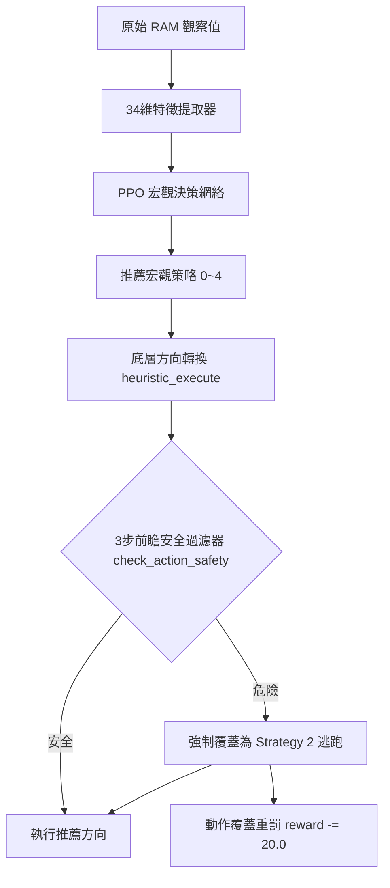

# Ms. Pac-Man 代理人策略與演算法優化報告

本報告詳盡記錄了 Ms. Pac-Man 決策代理人（Agent）目前已部署的強化學習架構、底層地圖拓撲優化、現行的 11 大核心防禦與決策策略，以及未來預計導入的高階演算法優化方案。

---

## 1. 核心架構與演算法總覽

本代理人採用 **階層式強化學習（Hierarchical RL）** 架構，結合底層的 **硬編碼安全過濾器（Safety Filter）** 與上層的 **近端策略優化（PPO）** 宏觀決策網絡。

### 1.1 宏觀動作空間 (Discrete(5))
PPO 網絡不直接輸出底層的上下左右（1~4）控制指令，而是輸出 5 種高層級戰略，再由 `heuristic_execute` 轉譯為具體前進方向：
* **`0` 吃豆子 (Eat Pellet)**：朝最近的普通豆子尋路。
* **`1` 吃能量球 (Eat Energizer)**：朝最近的能量球尋路。
* **`2` 逃跑 (Escape)**：遠離所有危險鬼魂。
* **`3` 追擊藍鬼 (Chase Scared Ghost)**：在時間充裕下全力追捕Scared Ghost。
* **`4` 等待/引誘 (Wait/Lure)**：在能量球附近徘徊，引誘鬼魂靠近後再吃球反噬。

### 1.2 觀測空間 (Box(34,))
提取 34 維具有物理意義的宏觀特徵向量，包括小精靈與鬼魂的相對位置、各方向 Dijkstra 安全距離、藍鬼剩餘時間、剩餘豆子與能量球比例等，避開直接輸入 RAM 的維度災難，加速 PPO 收斂。

---

## 2. 地圖基礎建設：1 像素精細插值與 Dijkstra 尋路

為了解決原先動態採集地圖存在「空白探索期」與「像素不連通」的痛點，本版本在底層地圖上進行了重大重構：

### 2.1 4 張迷宮地圖硬編碼與手動修補
* **硬編碼載入**：將所有 4 張迷宮的鄰接表以 `zlib + base64` 寫死在 [model.py](file:///Users/Shared/西洋棋代理人/rl_starter_12/model.py)，小精靈開局即擁有 perfect BFS/Dijkstra 全局尋路能力。
* **手動補丁 (Maze 3)**：針對 Maze 3 的左上角橫向通道（`Y=26, X:[34, 42]`）進行了手動修補，並**完全移除先前誤加的 Y=2 補丁**。
* **自動縫合**：實現了 3 像素內的 Gap 自動連通縫合，成功融合了 `(34, 155)` 至 `(34, 158)` 等採集時斷開的垂直邊。

### 2.2 1 像素級精細插值 (`interpolate_graph`)
原始採集點較為稀疏，若以物理像素移動會因中間無節點而造成尋路失效。本版本實作了以 1 像素為步長插值細化函數，將鄰接點之間的中間座標全部補齊。
* **Maze 3 載入點數**：高達 **1822 個點**（插值細化點顯著增加了高精度尋路的滑順度）。

### 2.3 Dijkstra 尋路（以像素距離為權重）
由於地圖細化到 1 像素，尋路算法全面以 Dijkstra 代替粗糙的 BFS。
* 權重計算法為兩點間的實際像素差：`weight = abs(x1 - x2) + abs(y1 - y2)`。
* 對於水平傳送門（Warp Tunnel，兩端跨度大於 20 像素），特別將其權重強制限制為 `4.0` 像素（相當於 1~2 步物理跨越時間），確保 Dijkstra 能正確引導小精靈使用傳送門擺脫鬼魂。

#### 📊 地圖連通性驗證數據
執行實測工具對重構後的迷宮進行分析，**所有迷宮的連通分量（Connected Components）數量均為 1**，代表全局 100% 連通，不存在孤立死胡同。

| 迷宮編號 | 關卡對應 (0-indexed) | 細化前節點數 | 細化後節點數 (model.py) | 連通分量個數 |
| :---: | :--- | :---: | :---: | :---: |
| **Maze 1** | Level 0, 1 | 1647 | 1797 | **1** (完美連通) |
| **Maze 2** | Level 2, 3 | 1622 | 1764 | **1** (完美連通) |
| **Maze 3** | Level 4, 5 | 1699 | 1822 | **1** (完美連通) |
| **Maze 4** | Level 6, 7 | 1482 | 1622 | **1** (完美連通) |

---

## 3. 現行已部署的 11 大防禦與決策優化

目前 [train.py](file:///Users/Shared/西洋棋代理人/rl_starter_12/train.py) 與 [model.py](file:///Users/Shared/西洋棋代理人/rl_starter_12/model.py) 中已落實的 11 大安全優化策略：

1. **動作遮罩重罰 (Action Masking Penalty)**：
   * **問題**：安全過濾器在底層強行覆蓋 PPO 選擇時，會讓 PPO 產生「選危險動作也能活」的錯誤反饋。
   * **對策**：一旦動作被過濾器改為 Strategy 2 (Escape)，立即扣分（`reward -= 20.0`），使神經網絡主動避開危險選項。
2. **鬼魂慣性動量預測 (Ghost Momentum Prediction)**：
   * **問題**：原先假設鬼魂在未來 3 步內可任意 180 度折返，導致安全預警範圍過大，造成小精靈在路口來回發抖。
   * **對策**：計算鬼魂前一幀到當前幀的移動向量 `(dx, dy)`，在 $t=1,2,3$ 步的模擬中**排除鬼魂 180 度折返路徑**，大幅流暢化穿梭路徑。
3. **硬編碼 4 張迷宮地圖 (Hardcode Mazes)**：
   * 確保進入新關卡（Maze 2+）沒有空白探索期，始終使用 perfect Dijkstra 進行全局尋路。
4. **跨回合地圖累積與分立存儲**：
   * `self.graphs` 存儲全部四張迷宮圖，關卡切換時只更新引用，不重建亦不清空，累積整個訓練週期的完整地圖資訊。
5. **曼哈頓安全退路 (Manhattan Fallback)**：
   * 當小精靈處於未記錄在圖中的極少數邊緣區域時（例如被鬼打飛後位移），安全過濾器與距離計算自動退回到基於座標偏移的曼哈頓距離，防止崩潰。
6. **前進動量機制 (Direction Momentum)**：
   * **優化實作**：在 Strategy 2（Escape）中，對與前一幀方向相同的動作給予 `+5.0` 像素距離加分，折返方向給予 `-5.0` 像素扣分。
   * **效果**：徹底消除了小精靈在十字路口因微小距離差而產生的「左右左右」發抖死鎖。
7. **避鬼警告懲罰下調 (Scaled Proximity Warnings)**：
   * 將靠近危險鬼魂的警告下調為 `dijkstra_dist <= 8` 時 `reward -= 1.0`；`<= 4` 時 `reward -= 3.0`。提供防禦導向的同時，不會壓過吃大豆（+100）或追擊藍鬼（+200+）的意願。
8. **藍鬼回復安全閥門 (Scared Ghost Timer Guard)**：
   * **優化實作**：僅在 `blue_timer > dist_in_pixels * 1.25` 時才執行追擊。如果時間不足，則自動降級回吃豆子或逃跑，防止追到一半藍鬼復原被反殺。
9. **傳送門自動連通 (Warp Tunnel Auto-Connection)**：
   * 最左端 `X <= 20` 與最右端 `X >= 156` 在圖中建立雙邊連通，使小精靈能把傳送門作為常規擺脫路徑。
10. **安全裕度緩衝黏性動作 (SAFETY_MARGIN Buffer)**：
    * **優化實作**：安全過濾器預判距離門檻全面設為 **`12.0` 像素**（相當於 3~4 步物理距離）。
    * **效果**：提供足夠的物理緩衝空間，完全吸收 MsPacman-v5 25% 動作重複（黏性動作）帶來的轉彎延遲。
11. **生命扣減強制重設 `prev_p` (Death Reset)**：
    * 當 `lives` 減少時，強制重置 `prev_p = None`，防範重生瞬間座標跳變被記錄為地圖的錯誤連線。

---

## 4. 未來預計演算法與優化方案

為了衝刺 15,000+ 至 20,000+ 分的上限，並解決保守硬編碼規則帶來的「極限操作受限」與「策略退化」問題，我們規劃了以下優化算法方案：

### 4.1 方案 1：安全裕度動態衰減 (Annealing SAFETY_MARGIN) — 💡 核心優化
* **痛點**：固定 `12.0` 像素（相當於 3 ~ 4 步）的安全邊界過於保守。這雖然確保了早期收斂，但完全扼殺了小精靈進行「貼身擦肩而過」和「傳送門時間差極限逃生」的可能。
* **對策**：將 `SAFETY_MARGIN` 與訓練總步數（Timesteps）進行線性退火掛鉤。
  * **訓練前期 (0 ~ 0.5M 步)**：維持 `12.0` 像素，提供最強的安全電網保護，使 PPO 快速學會吃豆。
  * **訓練中期 (0.5M ~ 1.5M 步)**：逐步將 `SAFETY_MARGIN` 由 `12.0` 線性縮小至 `7.0` ~ `8.0` 像素（約 2 步物理距離）。
  * **訓練後期 (1.5M 步以後)**：鎖定在 `6.0` ~ `7.0` 像素。
* **預期效果**：在 PPO 策略成型後逐步放寬限制，促使代理人利用 1 像素插值圖的高精度優勢，在高難度關卡中學會更精密的極限走位，釋放得分上限。

### 4.2 方案 2：動作覆蓋重罰的「退火衰減」 (Annealing Override Penalty) — 💡 核心優化
* **痛點**：固定 `-20.0` 的動作覆蓋重罰在後期會導致**策略退化**。PPO 網絡會因為害怕被罰款而變得分外擺爛，寧願一直推薦「絕對不會被覆蓋」的逃跑策略，將吃豆決策完全拋棄，使表現受限於硬編碼底層。
* **對策**：將動作被覆蓋的罰款與訓練進度掛鉤。
  * 前期維持 `-20.0`，強力約束 PPO 建立安全邊界意識。
  * 到了訓練中後期（如 1.0M 步後），逐步將覆蓋懲罰衰減至 `-5.0` 或 `-2.0`。
* **預期效果**：在神經網絡已具備基本避鬼常識後，調低罰款，鼓勵 PPO 在安全的邊緣進行高回報的「吃豆與追擊探索」，擺脫對底層 Heuristics 的依賴。

### 4.3 方案 3：吃豆路徑由「貪婪」升級為「局部連續密度最大化」 (Cluster-based Eating)
* **痛點**：目前的吃豆策略是單純用 Dijkstra 尋找最近的**單顆豆子**。這會導致小精靈為了一顆孤立豆子在左右兩端無效折返跑，浪費寶貴的關卡生存時間。
* **對策**：重構 `Eat Pellet` 的目標節點評估法。
  * 使用一個以小精靈為起點、半徑 25 像素的滑動窗口，評估前方各個分岔通道在 25 像素內的**豆子密度（連續豆子數量）**。
  * 目標節點設為「豆子密度最高」的連續通道終點，而非單純的最近鄰。
* **預期效果**：從小精靈的吃豆邏輯中徹底消滅「折返跑」，實現極富條理的「清掃式」過關，大幅降低通關總步數。

### 4.4 方案 4：基於拓撲環境的藍鬼動態追擊估算
* **痛點**：目前 `blue_timer > dist * 1.25` 的追擊閥值假設是線性的。但由於藍鬼會逃跑，開闊地帶小精靈常因追擊長度被拉長而超時暴斃；但在死胡同內明明追得到，又常因閥值被判定為時間不足。
* **對策**：在計算追擊距離時引入拓撲判定。
  * 若藍鬼正處於「死胡同」或地圖角落，追擊閥值係數降為 `1.0`。
  * 若藍鬼處於「開闊十字路口」，預估逃跑拉扯，將閥值係數提高為 `1.6`。
* **預期效果**：精準排除超時暴斃的高風險追擊，同時不錯過死胡同內高得分的捕獵機會。

### 4.5 方案 5：動作遮罩 PPO (Maskable PPO) & 安全區域連通性特徵 (Safe Connected Volume)
* **動作遮罩**：在 Action 輸出概率前套用安全 Filter 遮罩，確保 PPO 只在安全 macro-actions 間決策，避免策略梯度受 override 污染，收斂速度可提升 1.5 ~ 2 倍。
* **安全區域特徵**：在觀測空間中加入「當前未被鬼魂切斷的安全可達節點比例」，當該比例驟降時，引導 PPO 提早在大範圍上向開闊半區轉移。
