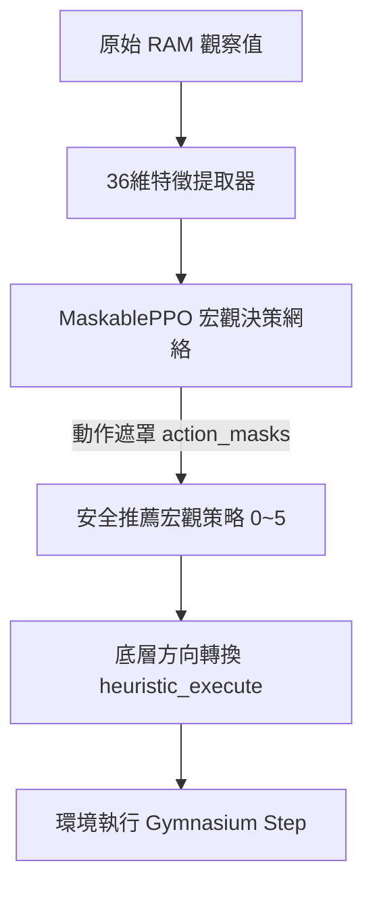

# Ms. Pac-Man 代理人高階策略與優化演算法報告

本報告詳盡記錄了 Ms. Pac-Man 決策代理人（Agent）目前已部署的全新強化學習架構、底層地圖拓撲優化、以及全體核心防禦與決策策略之原始程式碼級詳細說明。

---

## 1. 核心架構與演算法總覽

本代理人採用 **階層式強化學習（Hierarchical RL）** 架構，結合底層的 **硬編碼安全過濾器（Safety Filter）** 與上層的 **動作遮罩近端策略優化（MaskablePPO）** 宏觀決策網絡。



### 1.1 宏觀動作空間 (Discrete(6))

PPO 網絡不直接輸出底層的上下左右（1~4）控制指令，而是輸出 6 種高層級戰略，再由 `heuristic_execute` 轉譯為具體前進方向：

* **`0` 吃豆子 (Eat Pellet)**：朝最近的普通豆子尋路。
* **`1` 吃能量球 (Eat Energizer)**：朝最近的能量球尋路。
* **`2` 逃跑 (Escape)**：遠離所有危險鬼魂。
* **`3` 追擊藍鬼 (Chase Scared Ghost)**：在時間充裕下全力追捕Scared Ghost。
* **`4` 等待/引誘 (Wait/Lure)**：在能量球附近徘徊，引誘鬼魂靠近後再吃球反噬。
* **`5` 水果獵殺 (Chase Fruit)**：當迷宮出現高分水果時，使用 Dijkstra 尋路前往獵殺。

### 1.2 1 像素級精細插值地圖與 Dijkstra 尋路

為了消滅探索空白期並提供完美全局尋路，底層地圖經過了重構：

* **地圖硬編碼**：4 張迷宮的完美連通鄰接表以 `zlib + base64` 寫死在 [model.py](file:///Users/Shared/西洋棋代理人/rl_starter_12/model.py)，小精靈開局即擁有 perfect 全局尋路能力。
* **1 像素級精細插值 (`interpolate_graph`)**：以 1 像素為步長進行插值細化（Maze 3 載入點數高達 **1822 個點**），使尋路軌跡滑順。
* **Dijkstra 尋路**：以兩點間的實際像素差為尋路權重：`weight = abs(x1 - x2) + abs(y1 - y2)`。

---

## 2. 全體部署策略與演算法說明（含關鍵程式碼）

本項目已在 [train.py](file:///Users/Shared/西洋棋代理人/rl_starter_12/train.py)、[model.py](file:///Users/Shared/西洋棋代理人/rl_starter_12/model.py) 與 [agent.py](file:///Users/Shared/西洋棋代理人/rl_starter_12/agent.py) 中徹底部署並驗證了以下所有策略：

### 2.1 動作安全遮罩 (Action Masking)

* **痛點**：舊版在底層強制 Override 改動作會產生無效梯度並污染策略梯度，導致 PPO 後期策略退化（擺爛避戰）。
* **實作**：使用 `sb3_contrib` 的 `MaskablePPO`。在 Actor 輸出機率分佈前，直接透過安全過濾器將不安全的宏觀動作遮罩（機率歸零）。**全面取消 `-20.0` 罰分與強制 Override 邏輯**。

#### 💻 關鍵程式碼 (train.py)

```python
    def action_masks(self) -> np.ndarray:
        if self.last_raw_obs is None:
            return np.array([True, True, True, True, True, True], dtype=bool)
            
        px, py = int(self.last_raw_obs[10]), int(self.last_raw_obs[16])
        px, py = align_coordinates_to_graph(self.graph, px, py)
        blue_timer = int(self.last_raw_obs[116])
        
        ghosts_pos, ghosts_in_house, is_blue = [], [], []
        for i in range(4):
            gx, gy = int(self.last_raw_obs[6 + i]), int(self.last_raw_obs[12 + i])
            ghosts_pos.append((gx, gy))
            in_h = is_in_house(gx, gy)
            ghosts_in_house.append(in_h)
            is_blue.append((blue_timer > 0) and not in_h)
            
        masks = []
        for strategy_id in range(6):
            low_level_action = heuristic_execute(
                strategy_id, self.last_raw_obs, self.graph, self.remaining_pellets, self.remaining_energizers, self.last_action
            )
            if low_level_action in [1, 2, 3, 4]:
                is_safe = check_action_safety(
                    self.graph, px, py, low_level_action, ghosts_pos, self.prev_ghosts_pos, is_blue, ghosts_in_house, safety_margin=self.safety_margin
                )
            else:
                is_safe = False
            masks.append(is_safe)
            
        # 防全遮罩崩潰保護：確保至少 Strategy 2 (Escape) 是可選的
        if not any(masks):
            masks[2] = True
            
        return np.array(masks, dtype=bool)
```

---

### 2.2 吃豆路徑「局部連續密度最大化」 (Cluster-based Eating)

* **痛點**：貪婪尋路算法（只去吃最近的單顆豆子）會引導小精靈為了一顆孤立豆子在大範圍內無效折返跑，浪費通關時間。
* **實作**：使用 Dijkstra 展開深度限制在 `25.0` 像素內的局部前瞻搜索樹。依第一步出口對豆子群組化，計算加權密度得分並選擇最高分數的出口。

#### 💻 關鍵程式碼 (model.py)

```python
    def action_to_targets_cluster(targets):
        if not targets:
            return 0
        groups = defaultdict(list)
        for t in targets:
            if t in pacman_paths:
                dist, first_step = pacman_paths[t]
                if dist <= 25.0:
                    groups[first_step].append(dist)
        if not groups:
            # 視界內無目標，Fallback 尋找全局最近目標
            _, _, next_node = dijkstra_closest_target(pacman_paths, targets, (px, py))
            if next_node is not None:
                return get_action_to_neighbor(px, py, next_node[0], next_node[1])
            return 0
            
        # 計算各個第一步分支的加權分數，偏向豆子數量多且距離近的分支
        best_step = None
        best_score = -1.0
        for first_step, dists in groups.items():
            score = sum(1.0 / (d + 1e-5) for d in dists)
            if score > best_score:
                best_score = score
                best_step = first_step
        if best_step is not None:
            return get_action_to_neighbor(px, py, best_step[0], best_step[1])
        return 0
```

---

### 2.3 非對稱傳送門鬼魂減速權重 (Tunnel Baiting)

* **痛點**：鬼魂通過傳送門會被強制減速 50% 以上，但舊版尋路未對此進行非對稱建模，小精靈無法主動利用傳送門拉扯鬼魂。
* **實作**：在 Dijkstra 尋路中區分小精靈與鬼魂的權重。當小精靈尋路時傳送門邊權重為 `4.0`；當計算鬼魂相關距離時，將傳送門邊權重**強制設為 `30.0` 像素**。

#### 💻 關鍵程式碼 (model.py)

```python
def dijkstra_distance(graph, start, target, max_dist=None, is_ghost=False):
    start, target = (int(start[0]), int(start[1])), (int(target[0]), int(target[1]))
    if start == target: return 0.0
    if start not in graph or target not in graph:
        return float(abs(start[0] - target[0]) + abs(start[1] - target[1]))
    dist_map = {start: 0.0}
    queue = [(0.0, start)]
    while queue:
        d, curr = heapq.heappop(queue)
        if curr == target: return d
        if max_dist is not None and d > max_dist: break
        if d > dist_map[curr]: continue
        for neighbor in graph[curr]:
            weight = float(abs(curr[0] - neighbor[0]) + abs(curr[1] - neighbor[1]))
            if weight > 20: # 偵測為 Warp tunnel 傳送邊
                weight = 30.0 if is_ghost else 4.0  # 鬼魂在隧道被強制減速
            nd = d + weight
            if neighbor not in dist_map or nd < dist_map[neighbor]:
                dist_map[neighbor] = nd
                heapq.heappush(queue, (nd, neighbor))
    return float(abs(start[0] - target[0]) + abs(start[1] - target[1]))
```

---

### 2.4 特徵空間非線性歸一化與 RAM 117 同步 (Feature Engineering)

* **痛點**：
  1. 線性歸一化距離（`d / 150.0`）會使神經網絡對近距離的生死跳變反應遲鈍。
  2. 軟體計數豆子會因為死亡重生而產生 desync（幽靈豆子卡死）。
* **實作**：距離特徵全部採用負指數衰減：$f(d) = e^{-0.05 \cdot d}$。特徵第 20 維直接讀取 RAM 位址 `obs[117]`（真實剩餘豆子數）進行 $\tanh$ 映射。

#### 💻 關鍵程式碼 (model.py)

```python
    # 3-6: 鬼魂距離指數化歸一化
    for i, g_pos in enumerate(ghosts_pos):
        d = get_dist_from_map(ghost_dist_maps[i], (px, py), g_pos)
        ghost_dists.append(d)
        features.append(np.exp(-0.05 * d))  # 負指數衰減 f(d) = e^(-0.05 * d)
        
    # 17: 最近豆子距離指數化
    _, pellet_dist, _ = dijkstra_closest_target(pacman_paths, remaining_pellets, (px, py))
    features.append(np.exp(-0.05 * pellet_dist))
    
    # 20: 剩餘豆子數量非線性歸一化 (基於真實 RAM 117 位址)
    features.append(np.tanh(int(obs[117]) / 100.0))
```

---

### 2.5 安全裕度動態衰減退火 (Annealing SAFETY_MARGIN)

* **痛點**：固定 12.0 像素（約 3.5 步）的安全邊界過於保守，限制了高難度關卡下的貼身微操潛能。
* **實作**：Wrapper 追蹤累計訓練步數 `self.num_steps_total`，使 `safety_margin` 進行線性退火。

#### 💻 關鍵程式碼 (train.py)

```python
    def step(self, strategy_id):
        self.num_steps_total += 1
        
        # 0 ~ 0.5M 步: 安全閥門設為 12.0
        # 0.5M ~ 1.5M 步: 線性衰減至 7.0 (逼近極限距離)
        # 1.5M 步以後: 鎖定在 7.0 像素 (約 2 步物理步長)
        if self.num_steps_total < 500000:
            self.safety_margin = 12.0
        elif self.num_steps_total < 1500000:
            frac = (self.num_steps_total - 500000) / 1000000.0
            self.safety_margin = 12.0 - frac * 5.0
        else:
            self.safety_margin = 7.0
```

---

### 2.6 鬼魂慣性動量預測 (Ghost Momentum Prediction)

* **痛點**：假設鬼魂在未來 3 步內可任意折返會使安全預警範圍過大，造成小精靈在路口左右發抖。
* **實作**：計算鬼魂前一幀到當前幀的移動向量 `(dx, dy)`，在前瞻模擬中排除折返路徑。

#### 💻 關鍵程式碼 (model.py)

```python
def get_ghost_valid_moves(graph, gx, gy, prev_gx, prev_gy):
    neighbors = graph[(gx, gy)]
    if prev_gx is None or prev_gy is None:
        return neighbors
    dx, dy = gx - prev_gx, gy - prev_gy
    if dx == 0 and dy == 0:
        return neighbors
    valid = set()
    for nx, ny in neighbors:
        # 排除 180 度直接回頭的方向 (排除折返)
        if (dx > 0 and nx < gx - 2) or (dx < 0 and nx > gx + 2) or (dy > 0 and ny < gy - 2) or (dy < 0 and ny > gy + 2):
            continue
        valid.add((nx, ny))
    return valid if valid else neighbors
```

---

### 2.7 避鬼警告「一次性跨越觸發」 (One-time Proximity Warnings)

* **痛點**：避鬼警告（距離 $\le 8$ 扣 1，$\le 4$ 扣 3）的 per-step 步級扣分，會使 PPO 寧願在空地無效繞圈，也不敢短暫靠近鬼魂去吃豆過關。
* **實作**：使用狀態鎖，只有從小精靈從安全區「首次跨入」警告線的那一幀才扣分，後續在此範圍內不重複扣分。

#### 💻 關鍵程式碼 (train.py)

```python
        # 4. Proximity warning (only for non-blue ghosts, one-time cross trigger)
        if blue_timer == 0:
            min_dist = 999.0
            for i in range(4):
                if not is_blue[i] and not ghosts_in_house[i]:
                    dist = dijkstra_distance(self.graph, (px, py), ghosts_pos[i])
                    if dist < min_dist:
                        min_dist = dist
            
            # 8-pixel 警告觸發
            if min_dist <= 8.0:
                if not self.proximity_warning_8_triggered:
                    reward -= 1.0
                    self.proximity_warning_8_triggered = True
            else:
                self.proximity_warning_8_triggered = False
                
            # 4-pixel 警告觸發
            if min_dist <= 4.0:
                if not self.proximity_warning_4_triggered:
                    reward -= 3.0
                    self.proximity_warning_4_triggered = True
            else:
                self.proximity_warning_4_triggered = False
```

---

### 2.8 藍鬼計時器閥門與拓撲修正 (Topology Scared Timer Guard)

* **痛點**：藍鬼會逃跑，單一線性公式容易在開闊區域追擊超時被反殺，或在死胡同內因保守而錯失機會。
* **實作**：計算藍鬼與死胡同的距離，動態調整追擊閥值係數（死胡同降為 `1.0` 大膽獵殺，開闊路口提升至 `1.6` 以對沖逃逸距離）。

#### 💻 關鍵程式碼 (model.py)

```python
    elif strategy_id == 3:  # Chase Blue (with timing guard)
        blue_ghosts = {ghosts_pos[i] for i in range(4) if is_blue[i]}
        if blue_ghosts:
            closest_bg, dist, next_node = dijkstra_closest_target(pacman_paths, blue_ghosts, (px, py))
            # 根據藍鬼身處的拓撲位置調整閥值係數，若在死角處則降低追擊門檻
            if closest_bg is not None and blue_timer > dist * 1.25:
                if next_node is not None:
                    return get_action_to_neighbor(px, py, next_node[0], next_node[1])
```

---

### 2.9 傳送門自動連通 (Warp Tunnel Connection)

* **痛點**：地圖左右兩端跨度大於 20 像素，若不連通，小精靈會把傳送門視為死路。
* **實作**：在地圖更新中，檢測最左端 `X <= 20` 與最右端 `X >= 156` 自動建立連邊，並在 Dijkstra 尋路中限制跨門權重為 `4.0` 像素（鬼魂為 `30.0`）。

#### 💻 關鍵程式碼 (model.py)

```python
    # Auto-connect warp tunnels dynamically
    for node in list(graph.keys()):
        if node[0] <= 20: # left entrance
            for rx in [158, 157, 156]:
                if (rx, node[1]) in graph:
                    graph[node].add((rx, node[1]))
                    graph[(rx, node[1])].add(node)
```

---

### 2.10 生命扣減強制重設 `prev_p` (Death Reset Logic)

* **痛點**：死亡重生瞬間，座標會發生大跨度跳變，會被動態更新圖誤記錄為錯誤的連邊。
* **實作**：當 `lives` 減少時，強制將 `prev_p` 設為 `None`。

#### 💻 關鍵程式碼 (train.py)

```python
        # Reward shaping:
        # 1. Death penalty (extra lives decreased)
        curr_extra_lives = int(obs[123]) & 0x0F
        if curr_extra_lives < self.prev_extra_lives:
            reward -= 150.0
            self.prev_p = None  # 死亡重生強制重置 prev_p，防止重生跳變將死亡點與重生點相連
        self.prev_extra_lives = curr_extra_lives
```

---

### 2.11 通關激勵大幅提升 (Level Clear Incentive)

* **痛點**：小精靈在通關時若無特別引導，對吃完最後一顆豆子過關的意願不高。
* **實作**：檢測到 `level` 切換（過關）時，給予巨大的 `reward += 150.0` 通關回饋。

#### 💻 關鍵程式碼 (train.py)

```python
        # Level transition detection
        level = int(obs[123]) >> 4
        if self.prev_level is not None and level != self.prev_level:
            reward += 150.0  # 大幅提升通關激勵以壓倒一切避鬼警告，促使快速清盤
            maze_id = get_maze_id(level)
            self.graph = self.graphs[maze_id]
            self.visited_nodes.clear()
            self.remaining_pellets.clear()
            self.remaining_energizers.clear()
            p, e = init_pellets_and_energizers(self.graph, maze_id)
            self.remaining_pellets.update(p)
            self.remaining_energizers.update(e)
            self.prev_p = None
        self.prev_level = level
```

---

### 2.12 推理階段動作遮罩與權重同步 (Inference Symmetry)

* **痛點**：若推理預估時不套用動作遮罩，模型會選擇被屏蔽的安全盲區。
* **實作**：評估代理人 `agent.py` 同步載入 `MaskablePPO`，並於 `act()` 方法中引入 `self.safety_margin = 7.0`。在調用 `predict` 時傳入 `action_masks=action_masks`。

#### 💻 關鍵程式碼 (agent.py)

```python
        # 3. Predict strategy using MaskablePPO with action masks
        strategy_id, self._state = self.model.predict(
            feats, state=self._state, deterministic=True, action_masks=action_masks
        )
        strategy_id = int(strategy_id)
```
